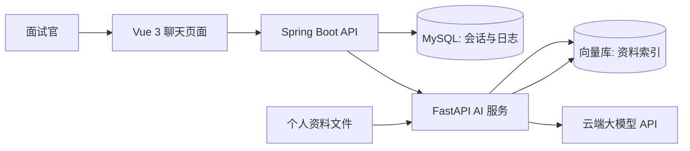

# 个人简历问答智能体：设计规格

## 目标

交付一个可通过公网链接访问的文字聊天应用。面试官可以围绕候选人的技能、项目、教育背景和经历提问；系统只能依据已导入的个人资料回答，并展示回答所依据的资料片段。

首版使用示例候选人资料包，后续可通过重新导入资料替换为真实简历内容。

## 范围

包含：公开聊天页、问答接口、个人资料导入与索引、带来源的 RAG 问答、会话与调用日志、云端部署。

不包含：账号体系、语音交互、主动模拟面试、评分、后台管理界面和本地开源模型。

## 架构

### 前端

Vue 3 单页应用展示简短个人简介、技能标签、示例问题和文字聊天窗口。答案下方展示引用资料的标题与摘录；错误信息使用面向访客的中文提示。

### Java 服务

Spring Boot 是唯一的浏览器后端。它创建或读取匿名会话 ID，验证请求，进行基础限流，调用 Python 服务，并持久化问题、答案、状态、耗时和错误摘要。它不保存模型密钥到数据库，也不把 Python 堆栈返回给浏览器。

### Python 服务

FastAPI 处理资料导入、文本切分、向量化、向量检索和大模型调用。回答生成提示词要求仅根据检索到的资料作答；若证据不足，返回明确的拒答结果而不是补充虚构内容。

### 数据存储

MySQL 存储会话和问答日志。向量库存储资料切片、向量、分类和来源元数据。首版可选用轻量本地向量库以降低部署复杂度，但接口需与具体实现隔离，便于后续迁移。

## 请求数据流

1. 访客输入问题，前端调用 Java 的聊天接口。
2. Java 校验非空、长度和频率，生成或复用会话，并把请求转交 Python。
3. Python 从向量库检索最相关的资料片段。
4. 如果相关性不足，Python 返回“资料不足”结果；否则将问题和片段发给云端模型。
5. Python 返回答案与引用片段；Java 记录结果和耗时；前端展示答案与来源。

## API 契约

`POST /api/chat/messages`

请求：`sessionId`（可选）与 `question`。

成功响应：`sessionId`、`answer`、`citations[]`（标题、分类、摘录）、`durationMs`。

资料不足响应：与成功响应相同，但 `answer` 明确说明无法从已导入资料确认，并且 `citations` 为空。

`POST /internal/ai/chat`

仅由 Java 调用的内部接口。接收问题和会话标识，返回答案、引用、资料不足标志与耗时。

## 异常与安全

- 模型 API 超时、Python 不可用或向量库故障：返回统一的“服务暂不可用，请稍后重试”，记录内部错误摘要。
- 输入超长或过于频繁：返回可理解的校验或限流提示。
- 密钥仅通过部署环境变量配置，日志中不得出现密钥、完整提示词或内部堆栈。
- 对资料不足的问题不编造履历；该行为是核心验收项。

## 测试与验收

- Python 单元测试：切分、检索排序、资料不足判定、提示词组装。
- Java 单元和集成测试：请求校验、限流、Python 接口映射、日志写入和错误转换。
- 契约测试：验证 Java 与 Python 的聊天请求/响应兼容。
- 端到端测试：资料导入后，预设问题能获得带引用回答；无依据问题被拒答；依赖服务失败时显示安全错误。
- 公网环境中可通过 HTTPS 链接打开页面并完成一次问答。

## 部署

使用容器化部署：前端静态资源、Java 服务、Python 服务和数据库作为独立服务；云平台以环境变量注入模型 API 密钥。对外只暴露前端和 Java API，Python 内部服务不直接开放给公网。

## 个人资料替换流程

1. 准备结构化的个人简介、技能、项目、教育经历与荣誉资料。
2. 将文件提交给 Python 导入接口或导入命令。
3. 清理旧索引并建立新向量索引。
4. 用覆盖各资料分类的预设问题回归验证，再部署新版本。
